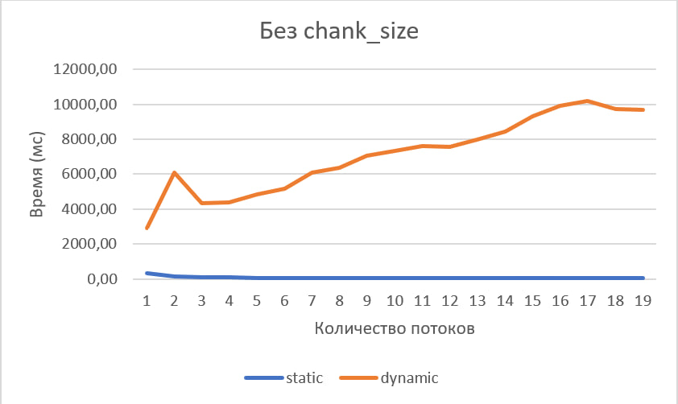

| Лабораторная работа №4 | M3104                         | АОВС |
| ---------------------- |-------------------------------| ---- |
| OpenMP                 | Каренин Константин Витальевич | 2024 |

> [!important]  
> Не забудьте указать в шапке свои ФИО и Номер группы

## Инструментарий
C++20\
OpenMP 2.0
gcc compiler

## Что реализовано
Многопоточное вычисление объема фигуры методом Монте-Карло

## Результат работы на тестовых данных: [ссылка на последний успешный action с актуальными данными](https://github.com/skkv-itmo-comp-arch/se-comp-arch24-omp-NicroNn/actions/runs/9355163516)

# Описание:

Тестирование производилось на Ryzen 7 5800x
При запуске без аргументов (запускается на максимальном числе потоков) в стандартный поток вывода выводится:\
``Time (16 thread(s)): 33 ms``\
В выходном файле результат подсчёта объёма piriform из примера:\
``1.25659``

## Использованные OpenMP конструкции
1. `#pragma omp parallel`\
Создание параллельного региона, у каждого потока будет своя копия этого фрагмента кода.
2. `#pragma omp for schedule(kind, chunk_size) nowait`\
Параллельное вычисление итераций цикла, с разными способами планирования (schedule):\
**static** - итерации цикла разбиваются на несколько блоков (chunks) и равномерно распределяются между потоками перед 
началом выполнения цикла, если не указан chunk_size, то размер блока определяется автоматически как (количество итераций)/(количество потоков).\
**dynamic** - итерации цикла также разбиваются на блоки, но каждый поток получает новый блок итераций только после завершения предыдущего блока,
если не указан chunk_size, то он равен 1.\
**guided** - итерации цикла разбиваются на блоки, размер которых уменьшается по мере выполнения цикла,
если не указан chunk_size, то он равен 1.\
**nowait** указывает, что потоки не будут ожидать завершения всех итераций цикла перед тем, как продолжить выполнение кода после цикла.
3. `#pragma omp atomic`\
Безопасное обновление общей для потоков переменной.
4. `omp_get_wtime()`\
Возвращает текущее время с точностью double.
5. `omp_get_thread_num()`\
Возвращает номер текущего потока (полезно если есть массив где данные потока лежат по индексу номера потока, или 
как в моём коде можно использовать в качестве сида для случайных чисел).
6. `omp_get_max_threads()`\
Возвращает максимальное количество потоков, которое может быть использовано в параллельном регионе.
7. `omp_set_num_threads(num_threads)`\
Устанавливает количество потоков, которое будет использоваться в последующих параллельных регионах.

## Работа написанного кода
В парраллельном участке кода создается локальный счётчик количества попаданий точек в фигуру, дальше параллельно запускается
цикл, в котором мы генерируем случайные координаты точки и проверяем попала ли она, после выхода из цикла прибавляем
значение локального счётчика к общему.

Для более быстрой генерации случайных чисел я реализовал линейный конгруэнтный генератор (`class LCG`), поскольку std
генераторы были медленнее.\
**Плюсы LCG:** высокая скорость и простая реализация\
**Минусы LCG:** числа на самом деле "не очень случаные"\
Поскольку генератор случайных чисел мне был нужен для расчета объёма трёхмерной фигуры методом Монте-Карло, 
а "случайность" LCG достаточная для этой задачи, я решил выбрать его для улучшения скорости работы.


Изучив [данную презентацию](https://www.openmp.org/wp-content/uploads/openmp-webinar-vanderPas-20210318.pdf) я решил
выделять для каждого потока объем данных соответствующий размеру кеш линии (64 байта), чтобы сделать код NUMA-friednly, 
поэтому реализовал `class thread_data`, куда перенёс данные, которые использовали потоки и дополнил до 64 байт.

Если прочитать [спецификацию](https://www.openmp.org/wp-content/uploads/cspec20.pdf) можно сделать вывод о скорости
различных параметров schedule (в разделе Тестирование будет видно наглядно)\

По данной картинке можно увидеть, что при использовании static или guided некоторые потоки простаивают.\
Код по которому строился данное сравнение (параметры schedule менялись):
```c++
#include <omp.h>

void work(long ww) {
    volatile long sum = 0;
    for (long w = 0; w < ww; w++) sum += w;
}

int main() {
    const long max = 32, factor = 10000000l;
    #pragma omp parallel for schedule(guided, 1)
    for (int i = 0; i < max; i++) {
         work((max - i) * factor);
    }
}
```
## Тестирование
1. **При различных значениях числа потоков при одинаковом параметре schedule (без chunk_size):**\
\
\
По данным графикам видно, что без параметра chunk_size dynamic значительно уступает static. Это происходит из-за того что,
в такой ситуации значение chunk_size у dynamic будет 1 и проблемы возникнут из-за частого планирования задач, у static
же chunk_size в такой ситуации будет вычислен так чтобы всем потокам достался равный размер задач и проблем с перепланированием не будет.
2. **При одинаковом значении числа потоков при различных параметрах schedule (с chunk_size):**\
\
\
Здесь можно увидеть как с увеличением размера чанка до 10000 растет скорость у dynamic, после он начинает замедляться
из-за того что начинают возникать барьеры при таком размере (как на графике который был приведён в реализации).
3. **С выключенным openmp и с включенным с 1 потоком:**\
\
По графикам видно что версия с 1 потоком работает быстрее чем просто реализация, скорее всего это происходит из-за дополнительных
оптимизаций при компиляции openmp кода, из-за чего кеш память может использоваться лучше. Также schedule влияет на работу даже
одного потока, а поскольку в версии без openmp его нет, возможно там хуже планируются задачи, что сказывается на замедлении.
4. **При оптимальной конфигурации schedule (определённой ранее) от числа потоков:**\
\
Здесь можно увидеть почти линейный рост скорость до момента когда используется 8 потоков, далее он немного замедляется,
это происходит потому что у моего процессора 8 ядер и 16 потоков, которые получаются благодаря SMT (у каждого физического
ядра есть 2 логических). Логические ядра не так хорошо влияют на скорость из-за не наилучшего распределения задач по
потокам, в идеальной ситуации они должны давать аналогичный прирост. После 16 скорость перестала расти поскольку у моего
процессора только 16 потоков.

Точные цифры можно увидеть в excel таблице, где и строились данные графики которая находится в `report_data/omp_analysis.xlsx`,
все результаты были получены усреднением 50 запусков программы с соответствующими параметрами. N = 100000000 (из условия)
